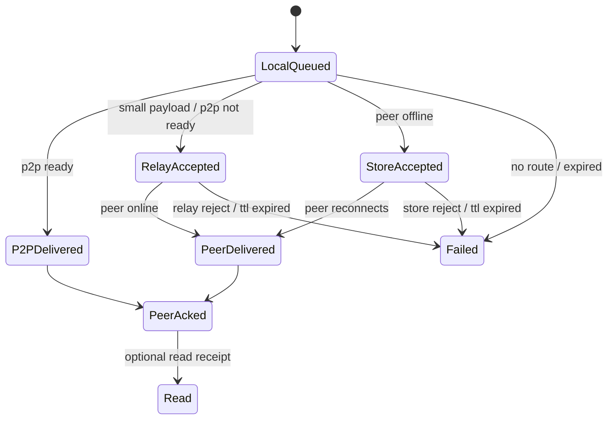

# Hybrid Delivery Technical Validation

## Validation Questions

1. Can we make text feel instant without waiting for P2P?
2. Can we keep large local transfers faster than LINE-style cloud upload?
3. Can we deliver to offline peers without exposing plaintext to SaaS providers?
4. Can we keep the UX simple: select conversation, type, send?

## Proposed Prototype Stack

Recommended first prototype:

- Cloudflare Workers: small authenticated delivery API.
- Cloudflare R2: encrypted file/object storage fallback.
- Ably: realtime wake/relay for text and ACK events.
- Local queue: existing persisted chat store plus future SQLite outbox table.

Why this stack:

- Workers run near users and have a meaningful free request tier.
- R2 has a generous free object-storage tier and no egress fees.
- Ably has a realtime-specific free tier with 6M messages/month and 200 concurrent connections.
- The app can still keep P2P as the fast path for direct LAN/Tailscale transfers.

## Prototype Scope

Phase A: Route selection

- Implement deterministic route decisions.
- Done: `src/features/delivery/deliveryStrategy.ts`
- Done: `src/features/delivery/deliveryStrategy.test.ts`

Phase B: Local adapter interfaces

- Add `deliveryTransport` abstraction with:
  - `sendViaP2P`
  - `sendViaRelay`
  - `storeForForward`
  - `markLocalQueued`
- Keep SaaS SDKs behind this boundary.

Phase C: Relay proof

- Send text envelopes over Ably/Pusher in a test channel.
- Require idempotent message ids.
- Measure time from Send click to relay ACK.

Phase D: Store-and-forward proof

- Encrypt a small text envelope locally.
- Store it through Worker/API.
- Poll or subscribe from the receiver.
- Decrypt only on receiver.

Phase E: File fallback proof

- Encrypt a file locally with per-file key.
- Upload ciphertext to R2.
- Deliver encrypted file pointer via relay/store.
- Receiver downloads and decrypts.
- Enforce TTL cleanup.

## Metrics

- Text relay ACK p50/p95.
- Peer delivery ACK p50/p95.
- P2P setup p50/p95.
- Direct file transfer throughput.
- Relay file transfer throughput.
- Store-and-forward upload/download time.
- Duplicate message rate.
- Failed-to-retry recovery rate.

## Delivery State Machine

## Risks

- Free SaaS limits can change. Keep provider-specific code isolated.
- Relay/store adds metadata leakage. Reduce metadata and use short TTLs.
- Push notifications on desktop are less reliable than mobile push. Use realtime wake while app is running; OS notification remains local.
- True LINE-level offline delivery requires a server-side mailbox. P2P-only cannot achieve that.
- Multiple devices per user require a device registry and per-device encryption.

## Next Implementation Steps

1. Add a provider-neutral delivery transport interface.
2. Move current `sendRealtimeMessage` behind the P2P transport.
3. Add local outbox records with route, attempts, next retry, and expiry.
4. Add an Ably/Pusher relay proof behind env flags.
5. Add Worker/R2 encrypted store proof behind env flags.
6. Add app UI states for relay accepted and store accepted.
