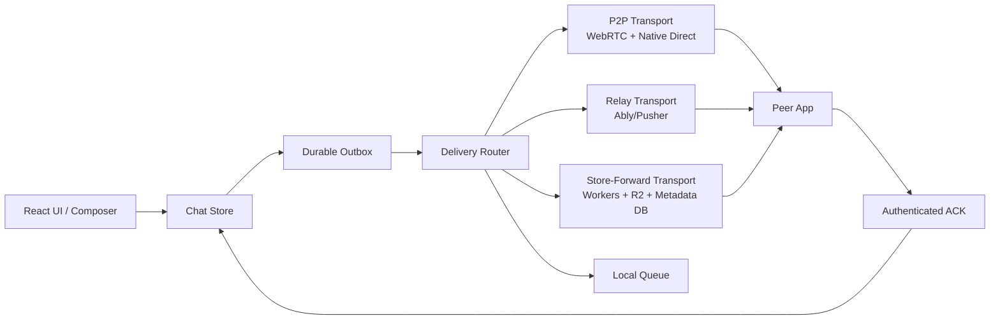
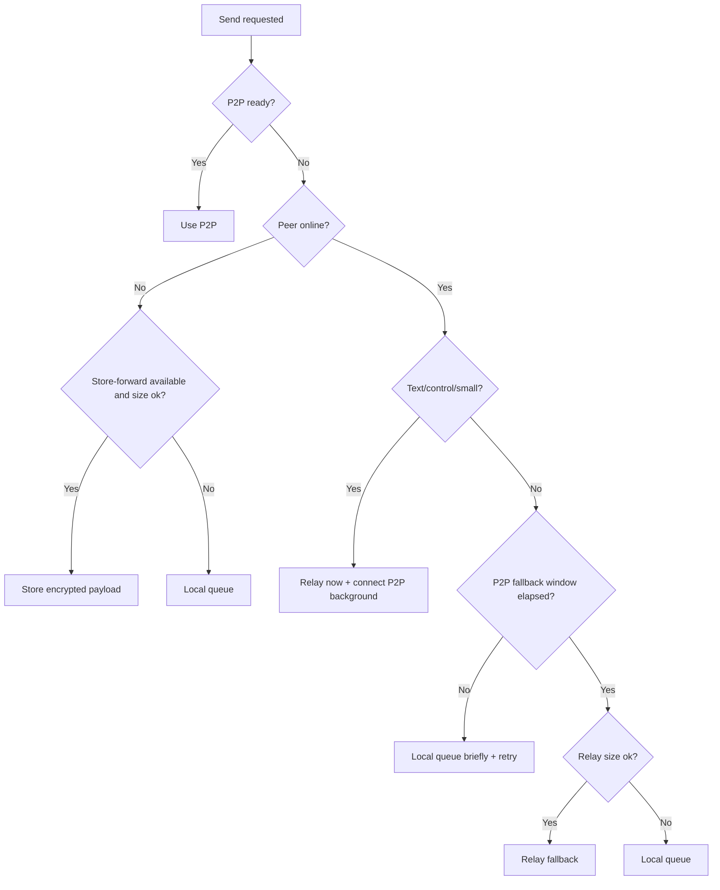

# V0.6.0 Hybrid Delivery Basic Design

## 1. Purpose

KunoChat v0.6.0 moves from "connect first, then send" to a LINE-like chat model:

- After the first pairing, users select a conversation and send immediately.
- The app chooses P2P, relay, store-and-forward, or local queue without asking the user.
- Text and control messages should feel instant.
- Large files should prefer LAN/Tailscale/P2P so KunoChat can be faster than cloud-only messengers.
- Offline delivery should be possible without exposing plaintext to SaaS providers.

This document is the basic design. Detailed module contracts and state transitions are defined in `docs/V0.6.0_HYBRID_DELIVERY_DETAILED_DESIGN.md`.

## 2. Scope

### In Scope

- Delivery route selection for text, control envelopes, images, and files.
- Local outbox and retry model.
- Provider-neutral transport boundaries.
- Relay delivery for small online payloads when P2P is not ready.
- Store-and-forward for offline encrypted payloads.
- UI states for queued, relay accepted, stored, delivered, and failed.
- Security requirements for encrypted relay/store payloads.
- Technical validation plan for Ably and Cloudflare Workers/R2.

### Out of Scope for v0.6.0

- Multi-device account sync.
- Mobile push notification delivery.
- Full contact/account system.
- Cross-device history backup.
- Paid infrastructure dependency.
- Server-side plaintext moderation or scanning.

## 3. Current Problems

Current KunoChat can send when a live peer connection exists, and v0.5.0 added offline local queue behavior. However:

- If P2P is not ready, text can wait longer than users expect.
- If the peer is offline, messages are only local unless both clients reconnect later.
- There is no server-side mailbox, so LINE-like offline delivery is incomplete.
- The UI has one global connection state even though users think in conversations.
- Send status currently does not distinguish local queue, relay accepted, store accepted, and peer delivered.

## 4. Design Goals

| ID | Goal | Target |
| --- | --- | --- |
| G1 | No required connect button after first pairing | Normal send path never blocks on a manual Connect action |
| G2 | Fast text delivery | Relay ACK within 500 ms p95 on normal network |
| G3 | Fast large files | Prefer direct transfer for files larger than instant payload threshold |
| G4 | Offline delivery | Store encrypted envelopes remotely when peer is offline |
| G5 | Privacy | SaaS providers never receive plaintext message/file bytes |
| G6 | Idempotency | Same message id cannot create duplicate visible messages |
| G7 | Provider isolation | Ably/Pusher/Cloudflare/Supabase code stays behind adapters |
| G8 | Local-first recovery | Local outbox can retry after app restart |

## 5. Non-Functional Requirements

### Performance

- P2P fallback window default: 1200 ms.
- Instant payload threshold default: 64 KiB.
- Relay max payload default: 100 MiB.
- Store-and-forward max payload default: 25 MiB.
- UI local echo must happen synchronously before any network operation.

### Reliability

- Every outgoing message must have a durable outbox record before network send starts.
- Network operations must be idempotent by `messageId`.
- Transient failures must not change a message to permanent failure unless retry policy expires.
- App restart must preserve queued and store-accepted messages.

### Security

- Relay/store payloads must be encrypted on sender before upload.
- Per-message envelope keys must not be available to SaaS providers.
- File fallback uses per-file content encryption keys.
- ACKs must be signed or MACed with a device/session key.
- TTL must be enforced for store-and-forward entries.

## 6. Architecture Overview

## 7. Delivery Routes

### P2P Direct

Use when:

- P2P control channel is ready.
- Native direct endpoint is reachable.
- Payload is a large file and P2P is still within the fallback wait window.

Expected behavior:

- Text and control use WebRTC control channel.
- Files use native direct transfer when available, otherwise WebRTC binary.
- File bodies do not upload to cloud unless fallback is explicitly selected.

### Realtime Relay

Use when:

- Peer is online but P2P is not ready.
- Payload is text/control/small image.
- P2P setup exceeded fallback window and payload is within relay limit.

Expected behavior:

- Sender gets `relay_accepted` after provider ACK.
- Receiver receives encrypted envelope through subscribed channel.
- Receiver decrypts locally and emits peer delivery ACK.
- P2P continues connecting in the background.

### Store-and-Forward

Use when:

- Peer is offline.
- Payload is within store-forward limits.
- Remote store provider is configured and healthy.

Expected behavior:

- Sender uploads encrypted envelope and optional encrypted file pointer.
- Sender gets `store_accepted`.
- Receiver fetches pending entries on app start and realtime wake.
- Receiver decrypts locally and sends peer delivery ACK.
- Server deletes or expires entries after delivery/TTL.

### Local Queue

Use when:

- Payload exceeds cloud limits.
- No fallback provider is configured.
- Privacy setting is direct-only.
- Remote provider returns a non-retryable rejection.

Expected behavior:

- Message stays visible as queued.
- App retries when route availability changes.
- User can cancel local queued messages.

## 8. Route Selection Summary

The validation implementation is `src/features/delivery/deliveryStrategy.ts`.

## 9. Conversation Model

Users do not think in network sessions. The app must map delivery to conversations:

- A conversation has one or more peer/device identifiers in the future, but v0.6.0 uses one peer device.
- Selecting a conversation starts background route discovery.
- Sending in a conversation never changes the active view to pairing.
- If a new peer is selected while connected to another peer, the app must avoid sending queued messages to the wrong peer.
- Each outbox item stores `conversationId` and resolved recipient device identity.

## 10. Delivery Status Model

| UI Status | Meaning | Source |
| --- | --- | --- |
| `local_queued` | Saved locally, no remote ACK yet | Outbox |
| `p2p_sending` | Direct channel is sending | P2P transport |
| `relay_accepted` | Relay provider accepted encrypted payload | Relay transport |
| `store_accepted` | Store accepted encrypted payload for offline peer | Store-forward transport |
| `peer_delivered` | Receiver app accepted and decrypted payload | Peer ACK |
| `read` | Receiver viewed conversation, future optional | Peer read receipt |
| `failed_retryable` | Temporary failure, scheduled retry | Router |
| `failed_final` | Expired or rejected permanently | Router |

Current `ChatMessage.status` may stay as the coarse UI status for v0.6.0, but detailed status should live in an outbox/delivery record.

## 11. External SaaS Direction

First validation stack:

- Ably for realtime relay and wake events.
- Cloudflare Workers for authenticated mailbox API.
- Cloudflare R2 for encrypted file object fallback.
- Existing local persistence first; later SQLite outbox.

Provider-specific code must not be imported from UI or chat store directly.

## 12. Rollout Plan

1. Add delivery transport interfaces and local outbox.
2. Wrap current P2P send path as `P2PDeliveryTransport`.
3. Add route router and state mapping, still with only P2P/local queue enabled.
4. Add relay proof behind env flags.
5. Add store-and-forward proof behind env flags.
6. Add encrypted file fallback proof.
7. Enable per-build provider configuration.
8. Run Win/Mac end-to-end tests.

## 13. Acceptance Checklist

- A user can send text in a known conversation while disconnected.
- The app can relay small text before P2P is ready.
- The app can store offline text and deliver it after receiver startup.
- Large files prefer direct transfer and do not upload during the P2P wait window.
- The same message id is never displayed twice.
- Manual pairing is only needed for first pairing, reset, or recovery.
- All fallback payloads are encrypted before leaving the app.
