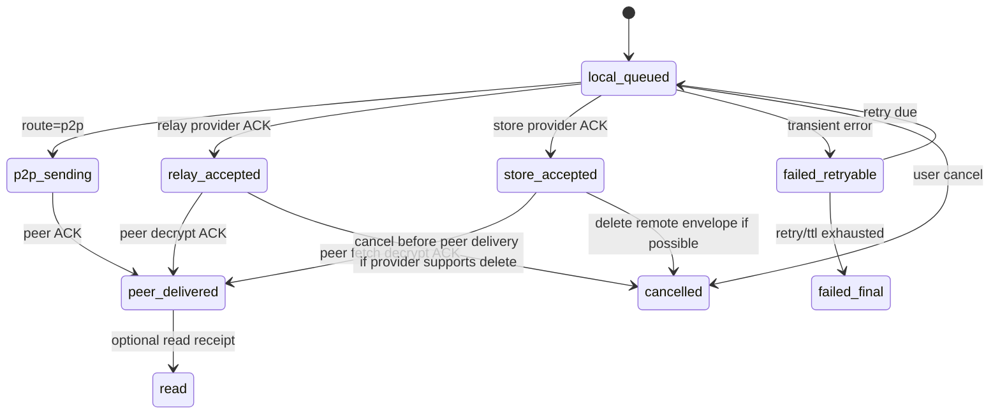
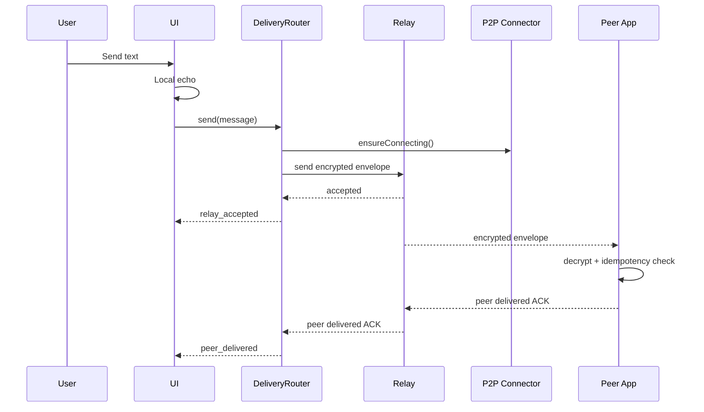
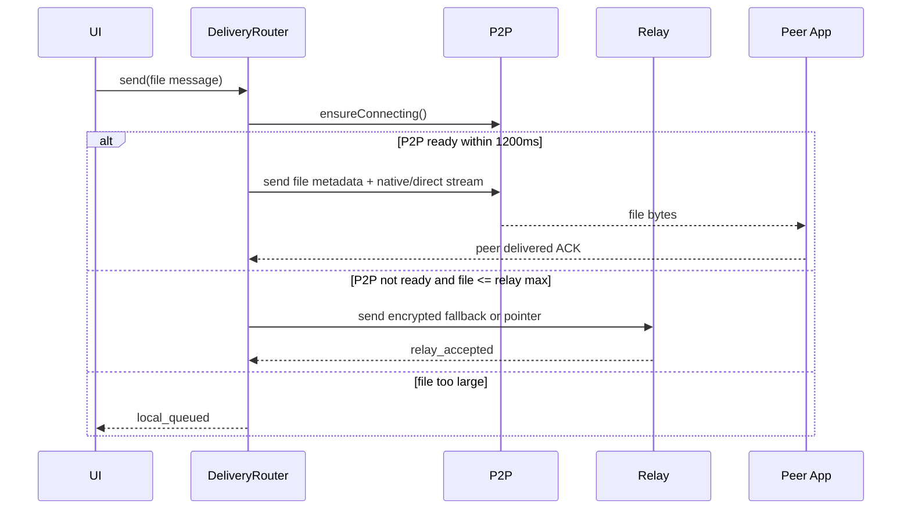
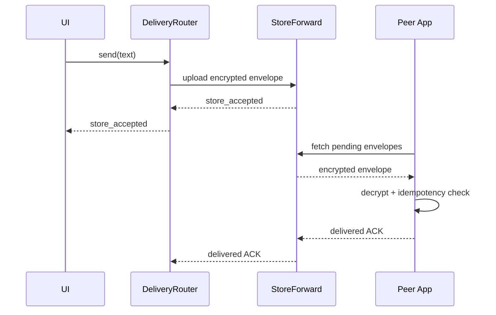

# V0.6.0 Hybrid Delivery Detailed Design

## 1. Module Boundaries

### New Modules

| Module | Responsibility |
| --- | --- |
| `src/features/delivery/deliveryStrategy.ts` | Pure route decision logic |
| `src/features/delivery/deliveryTypes.ts` | Shared delivery/outbox/provider types |
| `src/features/delivery/deliveryRouter.ts` | Orchestrates route choice, transport call, retry, status update |
| `src/features/delivery/outboxStore.ts` | Durable local outbox facade |
| `src/features/delivery/transports/p2pTransport.ts` | Adapter over current `sendRealtimeMessage` path |
| `src/features/delivery/transports/relayTransport.ts` | Ably/Pusher provider-neutral relay adapter |
| `src/features/delivery/transports/storeForwardTransport.ts` | Worker/R2 store-and-forward adapter |
| `src/features/delivery/cryptoEnvelope.ts` | Envelope encryption/decryption and ACK authentication |

### Existing Modules to Integrate

| Existing Module | Change |
| --- | --- |
| `src/app/App.tsx` | Calls delivery router instead of directly calling `sendRealtimeMessage` |
| `src/features/chat/chatStore.ts` | Owns visible message state; receives delivery status updates |
| `src/features/realtime/realtimeClient.ts` | Remains P2P realtime client |
| `src/features/native/platformAdapter.ts` | Supplies native file sources and future secure storage helpers |
| `src/features/storage/db.ts` | Candidate for durable outbox persistence |

## 2. Core Types

### DeliveryEnvelope

```ts
export type DeliveryEnvelope = {
  version: 1;
  messageId: string;
  conversationId: string;
  senderDeviceId: string;
  recipientDeviceIdHash: string;
  createdAt: number;
  expiresAt: number;
  payloadKind: "control" | "text" | "image" | "file";
  payloadSizeClass: "tiny" | "small" | "medium" | "large";
  ciphertext: string;
  nonce: string;
  keyId: string;
  attachmentRefs?: EncryptedAttachmentRef[];
};
```

Rules:

- `ciphertext` is base64url encoded encrypted JSON.
- Plaintext body, filename, caption, and MIME should not appear outside ciphertext where avoidable.
- `recipientDeviceIdHash` is stable enough for routing but not a raw public identifier.
- `expiresAt` is mandatory.

### OutboxRecord

```ts
export type OutboxRecord = {
  id: string;
  messageId: string;
  conversationId: string;
  recipientPeerId?: string;
  recipientPeerHint?: string;
  payloadKind: DeliveryPayloadKind;
  sizeBytes: number;
  route: DeliveryRoute;
  status:
    | "local_queued"
    | "p2p_sending"
    | "relay_accepted"
    | "store_accepted"
    | "peer_delivered"
    | "read"
    | "failed_retryable"
    | "failed_final"
    | "cancelled";
  attempts: number;
  lastAttemptAt?: number;
  nextRetryAt?: number;
  expiresAt: number;
  providerMessageId?: string;
  errorCode?: string;
  errorMessage?: string;
  createdAt: number;
  updatedAt: number;
};
```

Rules:

- One visible chat message can have one outbox record for text.
- A bundle can have one message-level outbox record plus per-attachment transfer records.
- `messageId` is idempotency key across all transports.
- `status` is more detailed than current `ChatMessage.status`.

### DeliveryTransport

```ts
export type DeliveryTransport = {
  readonly route: DeliveryRoute;
  isAvailable(context: DeliveryContext): Promise<boolean> | boolean;
  send(input: DeliverySendInput): Promise<DeliverySendResult>;
  cancel?(messageId: string): Promise<void>;
};

export type DeliverySendInput = {
  message: ChatMessage;
  outbox: OutboxRecord;
  envelope?: DeliveryEnvelope;
  binarySource?: RealtimeBinarySource;
};

export type DeliverySendResult = {
  status: "accepted" | "delivered";
  providerMessageId?: string;
  ackAt: number;
};
```

## 3. Delivery Router Algorithm

```ts
async function send(message: ChatMessage) {
  const outbox = await outboxStore.createOrUpdate(message);
  const context = await buildDeliveryContext(message);
  const decision = chooseDeliveryRoute(context);
  await outboxStore.markRoute(message.id, decision.route);
  await chatStore.applyDeliveryDecision(message.id, decision);

  if (decision.startP2PInBackground) {
    p2pConnector.ensureConnecting(message.conversationId);
  }

  switch (decision.route) {
    case "p2p":
      return sendP2P(message, outbox);
    case "relay":
      return sendRelay(message, outbox);
    case "store_forward":
      return storeForward(message, outbox);
    case "local_queue":
      return scheduleRetry(outbox, decision.retryAfterMs);
  }
}
```

Important:

- Local message creation remains in chat store before router send begins.
- Router must not create duplicate visible messages.
- Router must check active conversation/recipient identity before flushing queued records.
- P2P and relay may race in later versions, but v0.6.0 uses deterministic route choice to avoid duplicate complexity.

## 4. State Transitions



## 5. Sequence Designs

### 5.1 Online Text, P2P Not Ready



### 5.2 Online Large File



### 5.3 Offline Text



## 6. Persistence Design

### v0.6.0 Minimum

- Persist outbox records in the existing app persistence layer or SQLite if already stable.
- Persist provider ids, retry counters, route, detailed delivery status, and expiry.
- Do not persist raw `File` objects; persist path-backed file references only when available.

### Future SQLite Table

```sql
CREATE TABLE delivery_outbox (
  id TEXT PRIMARY KEY,
  message_id TEXT NOT NULL UNIQUE,
  conversation_id TEXT NOT NULL,
  recipient_peer_id TEXT,
  recipient_peer_hint TEXT,
  payload_kind TEXT NOT NULL,
  size_bytes INTEGER NOT NULL,
  route TEXT NOT NULL,
  status TEXT NOT NULL,
  attempts INTEGER NOT NULL DEFAULT 0,
  last_attempt_at INTEGER,
  next_retry_at INTEGER,
  expires_at INTEGER NOT NULL,
  provider_message_id TEXT,
  error_code TEXT,
  error_message TEXT,
  created_at INTEGER NOT NULL,
  updated_at INTEGER NOT NULL
);

CREATE INDEX idx_delivery_outbox_status_retry
  ON delivery_outbox(status, next_retry_at);

CREATE INDEX idx_delivery_outbox_conversation
  ON delivery_outbox(conversation_id, created_at);
```

## 7. Provider API Contracts

### Relay Provider

Required operations:

- `publishEnvelope(envelope): Promise<RelayAccepted>`
- `subscribe(deviceIdHash, handler): Promise<Unsubscribe>`
- `publishAck(ack): Promise<void>`

Required properties:

- At-least-once delivery is acceptable.
- Receiver must deduplicate by `messageId`.
- Relay provider ACK is not peer delivery.
- Payload must be encrypted before publish.

### Store-Forward Provider

Required operations:

- `putEnvelope(envelope): Promise<StoreAccepted>`
- `listPending(deviceIdHash): Promise<DeliveryEnvelope[]>`
- `ackDelivered(messageId, ack): Promise<void>`
- `deleteEnvelope(messageId): Promise<void>`
- `putEncryptedObject(ref, bytes): Promise<ObjectAccepted>`
- `getEncryptedObject(ref): Promise<ReadableStream>`

Required properties:

- TTL must be set server-side.
- Store must reject expired or oversized payloads.
- API must be idempotent by `messageId`.

## 8. Encryption and ACK Design

### Envelope Encryption

v0.6.0 design target:

- Use WebCrypto for symmetric content encryption.
- Use device identity public keys or a derived conversation key for envelope key wrapping.
- Include `messageId`, `conversationId`, sender, recipient hash, and expiry in associated data.
- Reject decrypt when associated data does not match.

### ACK Authentication

ACK plaintext:

```ts
export type DeliveryAck = {
  version: 1;
  messageId: string;
  conversationId: string;
  senderDeviceId: string;
  recipientDeviceId: string;
  status: "peer_delivered" | "read";
  at: number;
};
```

ACK must include a signature or MAC over the canonical ACK payload. The router must reject unsigned ACKs for `peer_delivered` and `read`.

## 9. Retry Policy

| Failure | Retry |
| --- | --- |
| P2P connecting timeout | Switch to relay if eligible |
| Relay transient error | Exponential backoff: 1s, 2s, 5s, 15s, 60s |
| Store transient error | Exponential backoff: 5s, 30s, 2m, 10m |
| Provider oversized | Local queue, no remote retry |
| Auth/config missing | Local queue, show setup-required diagnostic |
| Peer decrypt failure | Failed final unless sender can re-encrypt |
| Duplicate provider ACK | Ignore |

Retry must stop when:

- user cancels,
- message expires,
- attachment local reference is unavailable,
- route policy changes to direct-only and no P2P is available.

## 10. UI Mapping

Current message bubbles can continue to show compact status icons, but tooltips/status labels should map:

| Detailed status | Bubble icon | Tooltip |
| --- | --- | --- |
| `local_queued` | clock | Waiting to send |
| `p2p_sending` | spinner/clock | Sending directly |
| `relay_accepted` | single check | Sent to relay |
| `store_accepted` | cloud/check | Stored for delivery |
| `peer_delivered` | double check | Delivered |
| `read` | colored double check | Read |
| `failed_retryable` | warning + retry | Will retry |
| `failed_final` | warning | Failed |

Japanese UI text should be finalized during implementation; this design keeps English labels for code-facing clarity.

## 11. Configuration

Environment flags:

```env
VITE_DELIVERY_RELAY_PROVIDER=none|ably|pusher
VITE_DELIVERY_STORE_PROVIDER=none|cloudflare
VITE_DELIVERY_RELAY_MAX_BYTES=104857600
VITE_DELIVERY_STORE_MAX_BYTES=26214400
VITE_DELIVERY_P2P_FALLBACK_MS=1200
VITE_DELIVERY_DIRECT_ONLY=false
```

Secrets:

- Provider API secrets must not be bundled into the client.
- Client should receive short-lived publish/subscribe tokens from Worker/API.
- Local development may use public test keys only when scoped to disposable channels.

## 12. Migration Plan

1. Existing queued v0.5.0 messages map to `local_queued`.
2. Existing sent/received messages do not need outbox records.
3. On first v0.6.0 launch, create outbox records only for outgoing messages that are:
   - `queued`,
   - `sending`,
   - `failed` with retryable error,
   - `cancelled` is ignored.
4. If migration cannot resolve recipient identity, keep the message local and show recovery guidance.

## 13. Test Plan

### Unit Tests

- Route selection matrix.
- Outbox state transitions.
- Retry backoff calculations.
- Envelope associated-data validation.
- ACK signature/MAC verification.
- Idempotency duplicate handling.

### Integration Tests

- Relay publish/subscribe using a mock provider.
- Store-forward put/list/ack using a mock provider.
- P2P transport adapter preserving current send behavior.
- App restart with queued outbox.
- Attachment missing local path failure.

### Manual / Real Device Tests

- Windows to Windows same LAN.
- Windows to macOS same LAN.
- Windows to macOS Tailscale.
- Peer offline then app start.
- P2P blocked/firewalled then relay fallback.
- Large file over direct transfer.
- Large file over cloud limit remains local queued.

## 14. Implementation Order

1. Add `deliveryTypes.ts`.
2. Add in-memory `outboxStore` with persistence boundary.
3. Wrap current P2P send as `p2pTransport`.
4. Replace `App.handleSendDraft` transport call with `deliveryRouter.send`.
5. Add detailed status to chat store without changing visible UI drastically.
6. Add mock relay/store transports and tests.
7. Add real Ably relay behind env flag.
8. Add Worker/R2 store-forward behind env flag.
9. Add envelope encryption and authenticated ACK.
10. Run full Win/Mac release verification.

## 15. Open Decisions

| Decision | Default for v0.6.0 |
| --- | --- |
| Relay provider | Ably first, provider-neutral interface |
| Store metadata provider | Cloudflare Worker-owned storage API first |
| File object store | Cloudflare R2 |
| Read receipts | Design only, optional disabled by default |
| Multiple devices | Not implemented, keep model extensible |
| Direct-only privacy mode | Supported via config, UI later |
